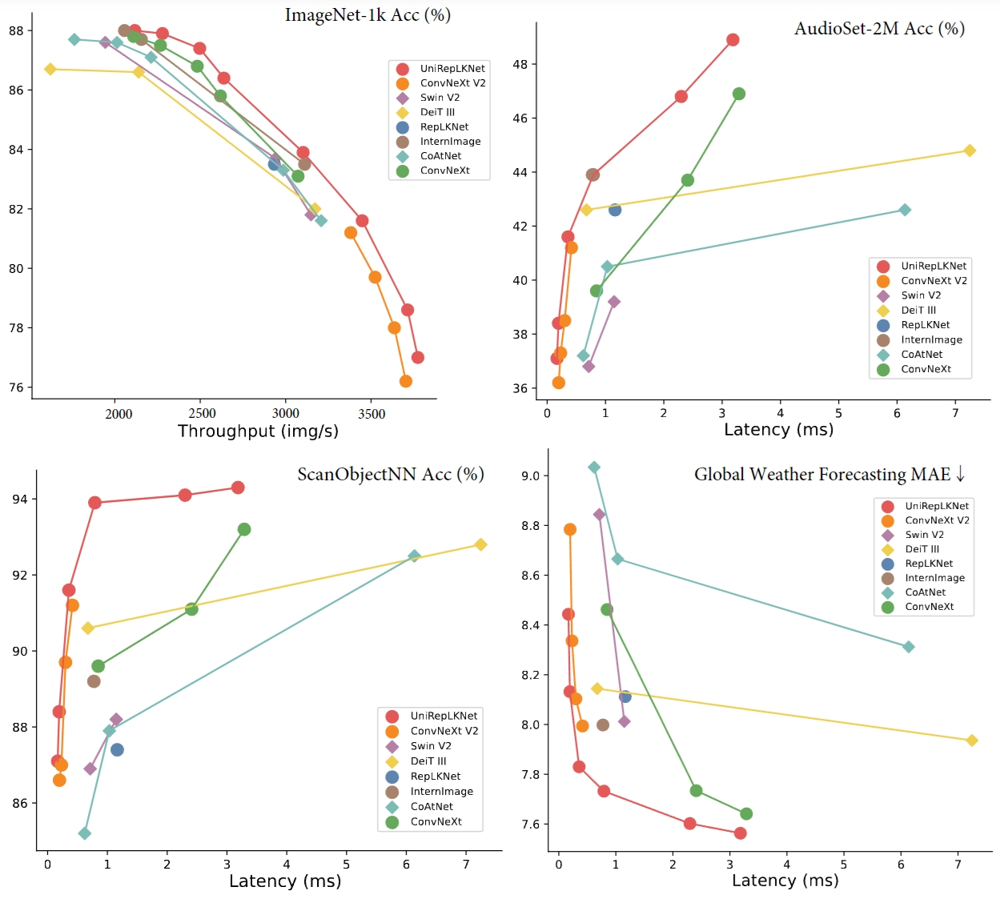

<p align="center">
<h1 align="center"><strong>UniRepLKNet: CVPR 2024,  TPAMI 2025</strong></h1>
  <p align="center">
  </p>
</p>

[](https://arxiv.org/abs/2311.15599)
[](https://arxiv.org/abs/2410.08049)
[](https://huggingface.co/DingXiaoH/UniRepLKNet/tree/main)
[](https://invictus717.github.io/UniRepLKNet/)
<a href="#LICENSE--citation">
  
</a>


<p align="center" width="100%">

</p>

🌟🌟🌟 ***News***: The journal version [Scaling Up Your Kernels: Large Kernel Design in ConvNets towards Universal Representations](https://arxiv.org/abs/2410.08049) is accepted by IEEE TPAMI.


## Motivation 
* We note that most architectures of the existing large-kernel ConvNets simply follow other models. **The architectural design for large-kernel ConvNets remains under-explored.**
* The *universal perception ability* of Transformers is sparking in multimodal research areas (image, audio, video, time-series, *etc*). We are curious whether ConvNets can also deliver **universal perception ability across multiple modalities with a unified architecture**.

## Highlights

A **ConvNet unifies multiple modalities and outperforms modality-specific models**. This paper summarizes architectural guidelines to build large-kernel CNN, which works amazingly well with images and other modalities. This is the latest contribution to both two influential areas - **Structural Re-param** (since RepVGG, Ding et al. 2021) and **very-large-kernel ConvNet** (since RepLKNet, Ding et al. 2022). **ImageNet accuracy of 88.0%, COCO AP of 56.4, ADE20K mIoU of 55.6 with only ImageNet-22K pretraining**. Higher actual speed and performance than recent models like ConvNeXt v2 and InternImage. With a unified architecture and extremely simple modality-specific preprocessing, achieves state-of-the-art performances on audio recognition and, most amazingly, **Global Temperature & Wind Speed Forecasting** (a challenging huge-scale time-series forecasting task), outperforming the existing global forecasting system.

More specifically, we contribute from two aspects:
* We propose four architectural guidelines for designing
large-kernel ConvNets, the core of which is to exploit
the essential characteristics of large kernels that distinguish
them from small kernels - they can see wide without
going deep. Following such guidelines, our proposed
large-kernel ConvNet shows leading performance in image
recognition.  
* We discover that large kernels are the key to
unlocking the exceptional performance of ConvNets in domains
where they were originally not proficient. With certain
modality-related preprocessing approaches, the proposed
model achieves state-of-the-art performance on time-series
forecasting and audio recognition tasks even without
modality-specific customization to the architecture.

**UniRepLKNet not only signifies a "comeback" for ConvNet in its original domain but also showcases large-kernel ConvNet’s potential to "conquer" new territories, highlighting further adaptability and broad utility across different modalities and tasks.**


## Code design

1. There is some MMDetection- and MMSegmentation-related code in ```unireplknet.py``` so that you can directly copy-paste it into your MMDetection or MMSegmentation, e.g., [here](unireplknet.py#L29) and [here](unireplknet.py#L617). If you do not want to use it with MMDetection or MMSegmentation, you can safely delete those lines of code.
2. We have provided code to automatically build our models and load our released weights. See the functions [here](unireplknet.py#L726). You can also use ```timm.create_model``` to build the models. For example, ```model = timm.create_model('unireplknet_l', num_classes=num_classes_of_your_task, in_22k_pretrained=True)``` will call the function ```unireplknet_l``` defined [here](https://github.com/AILab-CVC/UniRepLKNet/blob/main/unireplknet.py#L745), which will build a UniRepLKNet-L and automatically download our checkpoints and load the weights.
   ```
   # The simplest way to use our model in your project is to copy-paste unireplknet.py into your working directory and create models. For example
   from unireplknet import *
   model = timm.create_model('unireplknet_l', num_classes=num_classes_of_your_task, in_22k_pretrained=True)
   ```
4. As UniRepLKNet also uses the Structural Re-parameterization methodology, we provide a function ```reparameterize_unireplknet()``` that converts a trained UniRepLKNet into the inference structure, which equivalently removes the parallel branches in Dialted Reparam Blocks, Batch Norm layers, and the bias term in GRN. The pseudo-code of the full pipeline will be like
    ```python
    training_model = unireplknet_l(...,  deploy=False)
    train(training_model)
    trained_results = evaluate(training_model)
    training_model.reparameterize_unireplknet()
    inference_results = evaluate(training_model)
    # you will see inference_results are identical to trained_results
    save(training_model, 'converted_weights.pth')
    # use the converted model
    deploy_model = unireplknet_l(..., deploy=True)
    load_weights(deploy_model, 'converted_weights.pth')
    deploy_results = evaluate(deploy_model)
    # you will see deploy_results == inference_results == trained_results
    ```
5. You may want to read this if you are familiar with the [timm](https://github.com/huggingface/pytorch-image-models/tree/main) library. We sincerely thank timm for providing a convenient [re-parameterize function](https://github.com/huggingface/pytorch-image-models/blob/main/timm/utils/model.py#L225). The code design of UniRepLKNet is compatible with it. That is, calling ```some_unireplknet_model.reparameterize_unireplknet()``` is equivalent to calling ```timm.utils.reparameterize_model(some_unireplknet_model)```. So if you use our code with timm's codebase, e.g., timm's evaluation code, just add ```--reparam``` to your command so that ```timm.utils.reparameterize_model``` will be called (see [here](https://github.com/huggingface/pytorch-image-models/blob/main/validate.py#L128)).


## Models

We have provided five ways to download our checkpoints.

1. Download via the Google Drive links shown below.
2. Visit our huggingface repo at https://huggingface.co/DingXiaoH/UniRepLKNet/tree/main and click the download icons.
3. Use huggingface-hub in your python code. First, install huggingface_hub
```
pip install huggingface_hub
```
Then, use huggingface_hub like this in your python code, for example,
```python
from huggingface_hub import hf_hub_download
repo_id = 'DingXiaoH/UniRepLKNet'
cache_file = hf_hub_download(repo_id=repo_id, filename=FILE_NAME)
checkpoint = torch.load(cache_file, map_location='cpu')
model.load_state_dict(checkpoint)
```
See our [huggingface repo](https://huggingface.co/DingXiaoH/UniRepLKNet/tree/main) or [our code](unireplknet.py#L670) for FILE_NAME (e.g., ```unireplknet_xl_in22k_pretrain.pth```).

4. Use the huggingface CLI. Check the [tutorial](https://huggingface.co/docs/huggingface_hub/guides/download#download-from-the-cli).

5. Automatically download our checkpoints by passing ```in_1k_pretrained=True```, ```in_22k_pretrained=True```, or ```in_22k_to_1k=True``` while calling our provided functions. See the [code here](unireplknet.py#L738).

### ImageNet-1K Pretrained Weights

| name | resolution |acc@1 | #params | FLOPs | Weights |
|:---:|:---:|:---:|:---:| :---:|:---:|
| UniRepLKNet-A | 224x224 | 77.0 | 4.4M  | 0.6G | [ckpt](https://drive.google.com/file/d/1jUB-lq6NMTbeBvGTDvAarKWh-ZfMMZWt/view?usp=drive_link) |
| UniRepLKNet-F | 224x224 | 78.6 | 6.2M  | 0.9G | [ckpt](https://drive.google.com/file/d/1vYqhCNx3q-z0fVT4UZecFTUmb9IDaYh9/view?usp=drive_link) |
| UniRepLKNet-P | 224x224 | 80.2 | 10.7M  | 1.6G | [ckpt](https://drive.google.com/file/d/1D7rljWnnzEGDn8MDkvAWJ8qd1SCix6Vm/view?usp=drive_link) |
| UniRepLKNet-N | 224x224 | 81.6 | 18.3M | 2.8G | [ckpt](https://drive.google.com/file/d/1tMHOl55C7h44ag8SLUuaP0bBUUpVXhKj/view?usp=drive_link) |
| UniRepLKNet-T | 224x224 | 83.2 | 31M | 4.9G | [ckpt](https://drive.google.com/file/d/12Xon3FWkzEQV1nnNsF2U8XDMD-7NO2cJ/view?usp=drive_link) |
| UniRepLKNet-S | 224x224 | 83.9 | 56M   | 9.1G | [ckpt](https://drive.google.com/file/d/11YEOcKs4WNprRzCvKe-fB5z-l7zQv3kb/view?usp=drive_link) |

### ImageNet-22K Pretrained Weights

| name | resolution | #params | FLOPs | ckpt |
|:---:|:---:|:---:|:---:| :---:|
| UniRepLKNet-S | 224x224 | 56M | 26.7G  | [ckpt](https://drive.google.com/file/d/18ljg1qZKNxNvpUuOnrZSZ_DS81vGVU_9/view?usp=drive_link) |
| UniRepLKNet-B | 224x224 | 98M   | 47.2G   | [ckpt](https://drive.google.com/file/d/1t1txZOTpwXGUMVsqyUxpzE5EGLqMX5li/view?usp=drive_link)|
| UniRepLKNet-L | 192x192 | 218M  | 105.4G   | [ckpt](https://drive.google.com/file/d/1PEY474n6a7pZ3vJitsU7ZLzwBI00pf7u/view?usp=drive_link)|
| UniRepLKNet-XL | 192x192 | 386M  | 187G  | [ckpt](https://drive.google.com/file/d/1OP7I0jabljm8LKXTypk4HDmF9dQQqYib/view?usp=drive_link)|

### Pretrained on ImageNet-22K then finetuned on ImageNet-1K

| name | resolution |acc@1 | #params | FLOPs | ckpt |
|:---:|:---:|:---:|:---:| :---:| :---:|
| UniRepLKNet-S | 384x384 | 86.4 | 56M | 26.7G  | [ckpt](https://drive.google.com/file/d/1PzEHFOgEllMRIB-emkX_2VjXyBYC_X0z/view?usp=drive_link)|
| UniRepLKNet-B | 384x384 | 87.4 | 98M   | 47.2G   | [ckpt](https://drive.google.com/file/d/1T4BB3xx6FsWrK5QpTy7FwBrLuOMcZcEu/view?usp=drive_link)|
| UniRepLKNet-L | 384x384 | 87.9 | 218M  | 105.4G   | [ckpt](https://drive.google.com/file/d/10jJGzXX3cFRrfk3oAoIoWRnKSAaquQtM/view?usp=drive_link)|
| UniRepLKNet-XL | 384x384 | 88.0 | 386M  | 187G  | [ckpt](https://drive.google.com/file/d/1bS6DfAdQW-tHfyKOEpE_fXypi45CLnT3/view?usp=sharing)|

### COCO Object Detection

Code, document, and config files have been released. See the [detection guide](detection/README.md) here.

Checkpoints have already been released on hugging face. You can download them right now from https://huggingface.co/DingXiaoH/UniRepLKNet/tree/main.

Or you can download these checkpoints from Google Drive as follows:


| name | resolution |box mAP | mask mAP | #params | FLOPs | Weights |
|:---:|:---:|:---:|:---:| :---:|:---:|:---:|
| UniRepLKNet-T | 1280x800 | 51.7 | 44.9 | 89M  | 749G | [ckpt](https://drive.google.com/file/d/15LVEXyC8xxOIHhUeSFeolyZ1IVXVjQ4I/view?usp=drive_link) |
| UniRepLKNet-S | 1280x800 | 53.0 | 45.9 | 113M  | 835G | [ckpt](https://drive.google.com/file/d/1wcdMn35aMLgjIFVEIaJYMjOwMtuoz58I/view?usp=drive_link) |
| UniRepLKNet-S_22K | 1280x800 | 54.3 | 47.1 | 113M  | 835G | [ckpt](https://drive.google.com/file/d/1pZmrLRbM8bjiQvr_xenReXmtA7M3f_Ii/view?usp=sharing) |
| UniRepLKNet-B_22K | 1280x800 | 54.8 | 47.4 | 155M  | 978G | [ckpt](https://drive.google.com/file/d/1CCyk0q4E4tuFLWqafHIC-DywdJJ0-pMQ/view?usp=drive_link) |
| UniRepLKNet-L_22K | 1280x800 | 55.8 | 48.4 | 276M  | 1385G | [ckpt](https://drive.google.com/file/d/1m9WzhfhEF1KKxLH8IxE5vkM7HlucJu4N/view?usp=drive_link) |
| UniRepLKNet-XL_22K | 1280x800 | 56.4 | 49.0 | 443M  | 1952G | [ckpt](https://drive.google.com/file/d/1np1zCV_34MdOsViKMVdO1l4feLe8evmp/view?usp=drive_link) |

### ADE-20K Semantic Segmentation

Code, document, and config files have been released. See the [segmentation guide](segmentation/README.md) here.

Checkpoints have already been released on hugging face. You can download them right now from https://huggingface.co/DingXiaoH/UniRepLKNet/tree/main.

Or you can download these checkpoints from Google Drive as follows:

| name | resolution |mIoU (ss/ms) | #params | FLOPs | Weights |
|:---:|:---:|:---:|:---:| :---:|:---:|
| UniRepLKNet-T | 512x512 | 48.6/49.1 | 61M | 946G  | [ckpt](https://drive.google.com/file/d/1R2teeQt7q48EBBRbeVXShISpOmS5YHjs/view?usp=drive_link) |
| UniRepLKNet-S | 512x512 | 50.5/51.0 | 86M  | 1036G | [ckpt](https://drive.google.com/file/d/1SBHvbK4zoPSZ827F5Sp209LYIh2T7Iew/view?usp=drive_link) |
| UniRepLKNet-S_22K | 512x512 | 51.9/52.7 | 86M  | 1036G | [ckpt](https://drive.google.com/file/d/15dNuw34kia5qtt6UijcnutEktY05OrKH/view?usp=drive_link) |
| UniRepLKNet-S_22K | 640x640 | 52.3/52.7 | 86M  | 1618G | [ckpt](https://drive.google.com/file/d/1WVmAQ8sKDeX0APS9Q88z4dZge31kHx2v/view?usp=sharing) |   |
| UniRepLKNet-B_22K | 640x640 | 53.5/53.9 | 130M  | 1850G | [ckpt](https://drive.google.com/file/d/1sflCn8ny-cU5Bk8yBGE3E-yIO8eECE0H/view?usp=drive_link) |
| UniRepLKNet-L_22K | 640x640 | 54.5/55.0 | 254M  | 2507G | [ckpt](https://drive.google.com/file/d/1Qev75aKZY5bNAM17cLecD2OoZwKf5DA7/view?usp=drive_link) |
| UniRepLKNet-XL_22K | 640x640 | 55.2/55.6 | 425M  | 3420G | [ckpt](https://drive.google.com/file/d/1Ajwc7ZOk5eK19XX6VzgmAu2Wn0Dkb3jI/view?usp=sharing) |

## ImageNet evaluation and training

We give an example evaluation command.

Single-GPU
```
python main.py --model unireplknet_b --eval true \
--resume unireplknet_b_in22k_to_in1k_384_acc87.40.pth  \
--input_size 384 \
--data_path /path/to/imagenet-1k
```
Multi-GPU
```
python -m torch.distributed.launch --nproc_per_node=8 main.py \
--model unireplknet_b --eval true \
--resume unireplknet_b_in22k_to_in1k_384_acc87.40.pth  \
--input_size 384 \
--data_path /path/to/imagenet-1k
```
For training or finetuning UniRepLKNets on ImageNet-1K or 22K, see [this guide](/Image/README.md)

## Universal perception of audio, video, point cloud, and time-series tasks

For detailed documentation, please refer to these documents as follows:

* [Audio guide](/Audio/README.md)
* [Point cloud guide](/Point/README.md)
* [Time-series forecasting guide](/Time-Series/README.md)
* [Video guide](/Video/README.md)

## Use an efficient large-kernel convolution with PyTorch

We use a large-kernel conv implementation in **PyTorch** that is more efficient than the native torch.nn.Conv2d . It is implemented based on the iGEMM algorithm and a lightweight tool named cutlass. The installation is very simple and will cost you less than one minute. If you do not install this implementation, you can still use our model anywhere you wish but it will be a bit slower.

1. Download [cutlass.zip](https://github.com/DingXiaoH/RepLKNet-pytorch/blob/main/cutlass.zip), then ```unzip cutlass.zip```, enter the directory. This version of cutlass provided in this repository works fine with our large-kernel implementation and multiple python versions. You may alternatively use the cutlass branch maintained by the MegEngine team (clone https://github.com/MegEngine/cutlass), but you may need to be more careful with your python version (see [this issue](https://github.com/DingXiaoH/RepLKNet-pytorch/issues/34)).
2. ```cd examples/19_large_depthwise_conv2d_torch_extension```
3. ```./setup.py install --user```. If you get errors, check your ```CUDA_HOME```.
4. You may do a quick check to verify that the results of forward/backward computations are the same as torch.nn.Conv2d: ```python depthwise_conv2d_implicit_gemm.py```
5. Add ```PATH_TO_CUTLASS_DIRECTORY/examples/19_large_depthwise_conv2d_torch_extension``` into your ```PYTHONPATH``` so that you can ```from depthwise_conv2d_implicit_gemm import DepthWiseConv2dImplicitGEMM``` anywhere. Then you may use ```DepthWiseConv2dImplicitGEMM``` as a replacement of ```nn.Conv2d```.

It should work with a wide range of GPUs and PyTorch/CUDA versions. We suggest you try first and check the environments only if you get any errors. Our latest testes used both

1. Ubuntu 18.04 + CUDA 11.3 + nvcc 11.3 + cudnn 8.2.0 + python 3.8.12 + pytorch 1.10 + gcc 7.3.0 + nccl 2.10.3 + NVIDIA driver 450.102.04 + V100 and A100 GPUs
2. Ubuntu 18.04 + CUDA 10.2 + nvcc 10.0 + cudnn 7.6.5 + python 3.6.9 + pytorch 1.9 + gcc 7.5.0 + nccl 2.7.8 + NVIDIA driver 460.32.03 + 2080Ti and V100 GPUs

It is reported (see [here](https://github.com/DingXiaoH/RepLKNet-pytorch/issues/34)) that a python version mismatch may result in an error (```forward_fp32.cu(212): error: more than one instance of constructor "cutlass::Tensor4DCoord::Tensor4DCoord" ...``` or ```cutlass/include/cutlass/fast_math.h(741): error: no suitable conversion function from "__half" to "float" exists```). Please upgrade or downgrade your python. We sincerely thank @sleeplessai and @ewrfcas for sharing their experience.

Pull requests (e.g., better or other implementations or implementations on other frameworks) are welcomed.

## Citation

If the code and paper help your research, please kindly cite:

```
@article{zhang2024scaling,
  title={Scaling Up Your Kernels: Large Kernel Design in ConvNets towards Universal Representations},
  author={Zhang, Yiyuan and Ding, Xiaohan and Yue, Xiangyu},
  journal={arXiv preprint arXiv:2410.08049},
  year={2024}
}

@inproceedings{ding2024unireplknet,
  title={UniRepLKNet: A Universal Perception Large-Kernel ConvNet for Audio Video Point Cloud Time-Series and Image Recognition},
  author={Ding, Xiaohan and Zhang, Yiyuan and Ge, Yixiao and Zhao, Sijie and Song, Lin and Yue, Xiangyu and Shan, Ying},
  booktitle={Proceedings of the IEEE/CVF Conference on Computer Vision and Pattern Recognition},
  pages={5513--5524},
  year={2024}
}
```
## License
This project is released under the Apache 2.0 license. Please see the [LICENSE](LICENSE) file for more information.
